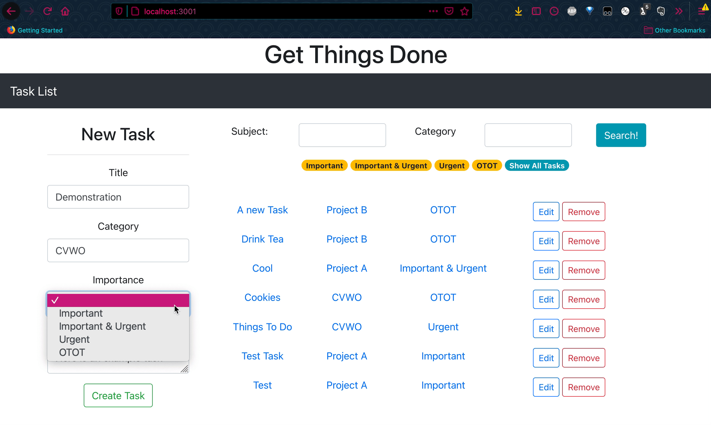
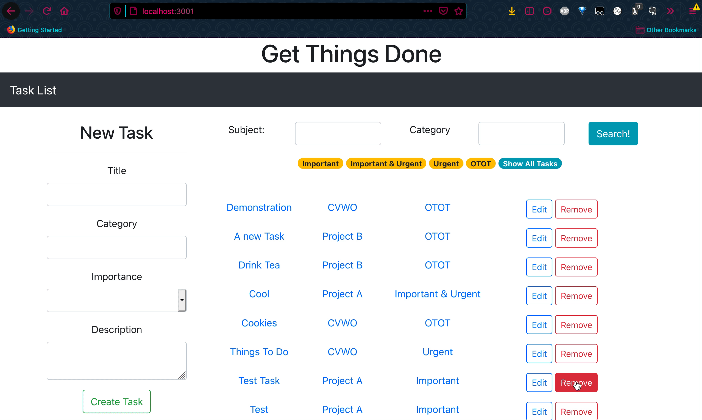
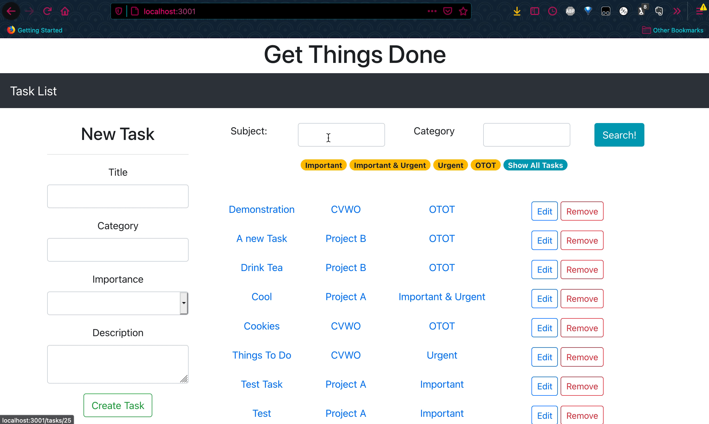

# cvwo-assignment
Computing for Voluntary Welfare Organisations, AY2020/21—Assignment

Name: Hannah Chia Kai Xin |
Matriculation Number: A0225702N

To run, please download the repository, running the rails app at localhost:3000 and the react app at another host! See the final writeup for instructions on how to use.

## The App

Create tasks with the menu on the left, and filter by importance using the tags at the top

The app supports CRUD: edit and delete tasks to your hearts content.

In order to find the task you are looking for, enter search terms into subject (searching title and description) and category (searching category) and hit search.

